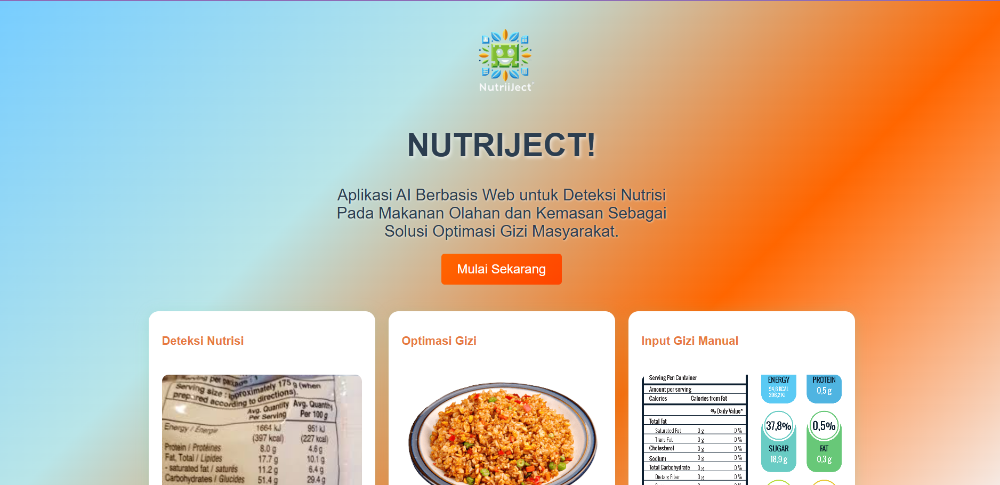
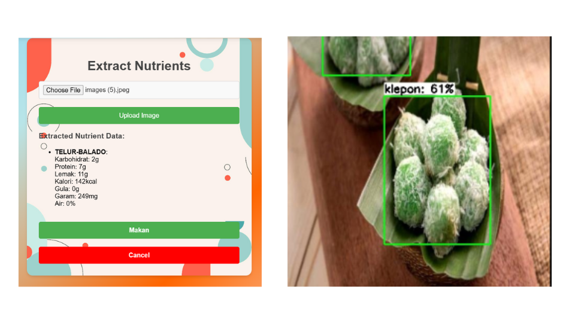

# 🍽️ Nutriject — AI-Powered Nutrition Tracker

**Nutriject** is an AI-based web platform designed to help users automatically monitor their nutritional intake using cutting-edge **Computer Vision**. With a simple food image, Nutriject detects the type of food and instantly calculates its nutritional value — no manual input needed.

> ⚡ Just take a photo. Let Nutriject do the rest.



---

## 🔍 Key Features

- 🧠 **AI-Powered Detection**: Automatically recognizes food items from images using a custom-trained object detection model.
- 📊 **Nutritional Analysis**: Calculates macro and micronutrients using a trusted nutrition database.
- 💻 **No Manual Input**: Fully automated, ideal for busy individuals, athletes, and health-conscious users.
- 📱 **Modern UI/UX**: Built with React.js for a fast and responsive web experience.

---

## 🧠 The AI Model

The object detection model behind Nutriject was trained using a combination of **open food datasets** and **custom image data** for improved accuracy on local cuisines and real-life portions.

- Trained with **YOLOv8** via **Ultralytics** on [Google Colab]
- Fine-tuned on personal and real-world food data for better generalization
- For details and model file, visit this drive:  
  👉 [Model File Drive](https://drive.google.com/drive/folders/1dsuDrnyWxShcplSJkroYt3cYS70xTABS?usp=sharing)

---

## 🛰️ Model Deployment

The model is served using:

- 🧠 **Google Colab** as the compute environment
- 🌐 **Ngrok** to expose the local server to a public URL
- 🚀 **FastAPI** as the lightweight backend API

To run the model server:

1. Open the [Colab Deployment Notebook](https://colab.research.google.com/drive/1e__wjtRh_vfeO4WIU3j9G82b4lXQd349?usp=sharing)
2. Connect your Google Drive and mount the model assets [Model File Drive](https://drive.google.com/drive/folders/1dsuDrnyWxShcplSJkroYt3cYS70xTABS?usp=sharing)
3. Paste your **Ngrok API key** to the cell
4. Copy the **Ngrok public URL** once the server is running

---

## 🔧 Nutriject Web App - Getting Started (User-Friendly)

Welcome to Nutriject! Follow the steps below to get started and set up your API connection.

### 1. **Visit the Website**

- Go to the Nutriject Web App at [https://nutriject.vercel.app/](https://nutriject.vercel.app/).

### 2. **Go to the Settings Page**

- Once you're on the homepage, click on the **Settings** link in the navigation bar or directly navigate to the settings page.

### 3. **Create an Account on Ngrok**

- Go to [Ngrok's website](https://ngrok.com/) and create an account.
- Once logged in, copy your **NGROK Auth Token**.  
  **(See example image below)**


### 4. **Open the AI Server on Colab**

- Open the AI server on Google Colab by clicking the link below:  
  [Colab Server Link](https://colab.research.google.com/drive/1n9nqZc5Gwr38vofAJ8vRHBGC11_VBtbT?usp=sharing)

### 5. **Paste Your Ngrok Token**

- In the Colab notebook, find the input field for Ngrok Token.
- Paste your **Ngrok Auth Token** into this input field.

### 6. **Connect to Colab Runtime**

- You don't need a GPU, just connect to the Colab runtime by clicking the **Connect** button in the top-right corner.

### 7. **Run All Cells**

- Press `Ctrl + F9` or go to **Runtime > Run all** to execute all cells in the Colab notebook.  
  **(See example image below)**


### 8. **Copy the Generated API Link**

- Wait for the API link to appear. Once it does, copy the generated link.  
  **(See example image below)**


### 9. **Paste the API Link in Settings**

- Return to the Nutriject settings page.
- Paste the copied **API link** into the settings input field and click **Save API**.

### 10. **You're Ready to Start!**

- After saving the API link, you’re ready to start using Nutriject and enjoy the features! 🎉

---

### Need Help?

If you encounter any issues, feel free to reach out to our support team at hauzantsaaqif28@gmail.com.

---

## 🚀 Getting Started for Web Dev

To use the Nutriject Web App:

1. **Clone this repository**:

   ```bash
   git clone https://github.com/yourusername/nutriject.git
   cd nutriject

   ```

2. **Update the API URL**:  
   Replace all API endpoint URLs inside the React project with the **Ngrok public URL** obtained from the Colab deployment.

   Specifically, update the API URL in the following files:

   - `src/pages/PhotoInput.jsx`
   - `src/services/api.js`

3. **Install dependencies**:

   ```bash
   npm install

   ```

4. **Start the UI Website**:
   ```bash
   npm start
   ```

Now, you're ready to test the app. Upload a food image and watch Nutriject break down the nutrition info automatically! 🍱

## Example Output



## 🧰 Tech Stack

- **Frontend**: React.js
- **Backend**: FastAPI (served via Colab + Ngrok)
- **Model**: YOLOv8 (Ultralytics)
- **Deployment**: Google Colab for backend API
- **Data**: Custom + Public Food Datasets on Roboflow

---

## 🖼️ Sample Use Case

Check out before-after visual examples (coming soon) where Nutriject identifies meals and outputs their nutritional content — perfect for creators, nutritionists, and dieticians.

---

## 🤝 Contributions

Contributions, feature suggestions, or feedback are welcome!  
Feel free to open issues or submit pull requests.

---

## 📄 License

This project is licensed under the **MIT License** — use freely with attribution.

---

> “Track smart, eat smart. Nutriject helps you know your plate better.”
